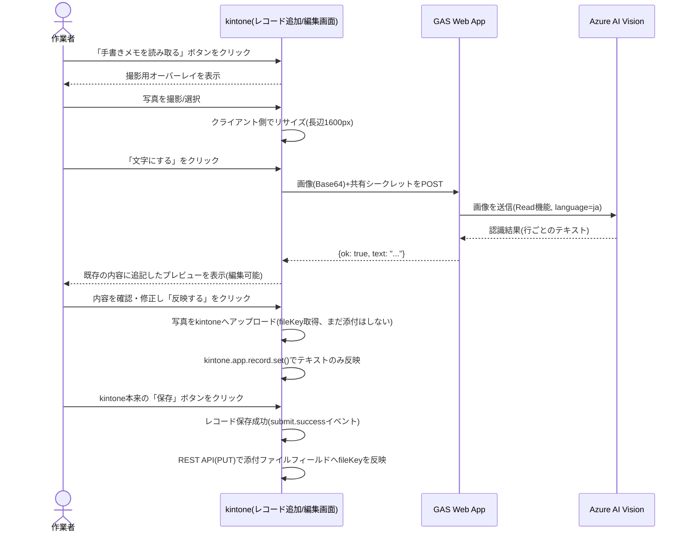

# handwriting-input

紙に手書きされたメモを撮影するだけで、文字を自動認識してkintoneのフィールドへ転記するkintoneカスタマイズ + GAS（Azure AI Visionへの中継Web App）です。

## 背景

製造業の現場ではタブレットへの直接入力に抵抗があり、紙のメモがなかなか無くならない、という課題に向けたカスタマイズです。作業者は今まで通り紙にメモを書き、**それを撮影するだけ**でkintoneへ文字として記録できます。手書きの習慣そのものを変える必要がありません。

## 構成

- `src/` — kintone側（JS/CSSカスタマイズとして対象アプリへ直接アップロードする。撮影UI・リサイズ・GAS呼び出し・kintoneへの反映）
- `gas/` — Google Apps Script側（Azure AI Visionへの中継Web App）。セットアップ手順は [gas/README.md](./gas/README.md) を参照

## 特長

- 写真を撮る（または選ぶ）→「文字にする」→ 内容を確認 → 「反映する」の4ステップだけで完結。非IT専門家でも直感的に使える
- Azure AI Vision（Image Analysis 4.0のRead機能）による手書き日本語認識。無料枠（5,000件/月）を超えてもエラーになるだけで自動課金されない設計（詳細は[CLAUDE.md](./CLAUDE.md)参照）
- AzureのAPIキーはGAS側にのみ保持し、ブラウザ側には一切渡さない
- 認識結果は編集可能なプレビューを経てから反映するため、OCRの誤認識をその場で修正できる（「下書き自動作成」という位置付け）
- 撮影した写真の原本も添付ファイルとして自動保存されるため、後から見返せる（現物との突き合わせ・監査対応）
- 1レコードに複数の手書き入力欄を設定可能（`HANDWRITING_TARGETS`配列で構成）

## なぜこの方式か（技術選定の経緯）

以下は実装前に検証した内容で、方針を再検討する際は必ず踏まえてください（詳細は[CLAUDE.md](./CLAUDE.md)参照）。

1. **ブラウザ内蔵の無料OCR（Tesseract.js）は不採用**: マス目に区切って1文字ずつ認識させる方式を検証したが、単純な英字ですら誤認識し、空白のマスにも幻の文字を検出するなど、実用に耐えなかった
2. **OS標準の手書き認識（Windows Ink/Scribble等）も不採用**: これは「タブレットに直接ペンで書く」方式向けの機能であり、「紙に書かれた既存のメモを読み取る」という本来の要求とは前提が異なる
3. **Azure AI Vision（無料枠）を採用**: 手書き日本語に対応しており、無料枠を超えても自動課金されない安全な設計。登録の手間は増えるが、精度と安全な無料運用を両立できる唯一の現実的な選択肢だった

## 処理の流れ



**注意**: 添付ファイルフィールドは`kintone.app.record.set()`では更新できない仕様（公式ドキュメントの制限事項に明記）のため、「反映する」の時点ではテキストだけが入り、**写真はkintone本来の保存ボタンを押した後に反映されます**。詳細は[CLAUDE.md](./CLAUDE.md#なぜ反映するの時点で添付ファイルを直接セットしないのか重要)を参照してください。

## デモ用kintoneアプリの構成案:「現場日報」

顧客デモ・検証用に、以下のようなシンプルな日報アプリを想定しています。実運用では、対象顧客の既存の日報・点検記録アプリにフィールドを追加する形でも組み込めます。

### フィールド一覧

| フィールドコード   | 型                                     | 説明                                                         |
| ------------------ | -------------------------------------- | ------------------------------------------------------------ |
| `RECORD_DATE`      | 日付                                   | 日付                                                         |
| `WORKER_NAME`      | 文字列（1行）                          | 作業者名                                                     |
| `PROCESS_LINE`     | 文字列（1行）                          | 工程・ライン名                                               |
| `WORK_NOTES`       | 文字列（複数行）                       | 作業内容（手書き入力対応）                                   |
| `space_work_notes` | スペース（要素ID: `space_work_notes`） | 「作業内容を手書きメモから読み取る」ボタンの設置場所         |
| `WORK_NOTES_PHOTO` | 添付ファイル                           | 作業内容メモの写真（原本、自動保存）                         |
| `REMARKS`          | 文字列（複数行）                       | 気づき・特記事項（手書き入力対応）                           |
| `space_remarks`    | スペース（要素ID: `space_remarks`）    | 「気づき・特記事項を手書きメモから読み取る」ボタンの設置場所 |
| `REMARKS_PHOTO`    | 添付ファイル                           | 特記事項メモの写真（原本、自動保存）                         |

### レイアウト上の注意

スペースフィールドは、対応する文字列フィールドの**直後**に配置してください（ボタンがどのフィールド向けかが一目で分かるようにするため）。スペースフィールドの要素IDは、フィールド配置後に「スペースフィールド」設定画面で指定します（`src/desktop.js`の`HANDWRITING_TARGETS`の`spaceId`と一致させること）。

## デモの見せ方（提案）

1. 白紙に「本日の作業:部品Aの組立完了。午後は検品予定。」のようなメモを実際に手書きする
2. スマートフォン/タブレットでそのメモを撮影し、「文字にする」を押す
3. 数秒後にテキストへ変換された内容が表示され、「反映する」でkintoneのレコードに即座に反映される様子を見せる
4. 添付ファイルに撮影した写真そのものも残っている点（原本との突き合わせができる）もあわせて紹介する

「紙をやめさせる」のではなく「紙の運用のまま、記録だけkintoneに残せる」という導入ハードルの低さが訴求ポイントです。

## セットアップ

### 1. GAS側（Azure中継Web App）

[gas/README.md](./gas/README.md) の手順に従い、Azureリソースの作成・GAS Web Appのデプロイを行ってください。**この手順は開発側（納品元）が一度だけ行うもので、顧客側の作業ではありません。**

### 2. kintone側

対象アプリに、上記「デモ用kintoneアプリの構成案」を参考にフィールドを作成してください（実際のフィールドコード・要素IDは`src/desktop.js`の`HANDWRITING_TARGETS`と一致させること）。

`src/desktop.js`の以下2箇所を、実際の値に書き換えてください。

```js
const GAS_WEB_APP_URL =
    'https://script.google.com/macros/s/REPLACE_WITH_DEPLOYMENT_ID/exec';
const GAS_SHARED_SECRET = 'REPLACE_WITH_SHARED_SECRET';
```

「アプリの設定」→「JavaScript / CSSでカスタマイズ」から、以下を**「PC用」と「モバイル用」の両方**にアップロードしてください（同じファイルを共用します。モバイル用にも入れないと、スマホのkintoneアプリでボタンが表示されません）。

- JavaScript: `src/desktop.js`
- CSS: `src/css/desktop.css`

ボタンは「📷 写真を撮る／選ぶ」の1つです。押すと、カメラが起動できる環境ではカメラが直接開き、そうでない環境（PC・kintoneモバイルアプリのWebView等）ではOS標準のメニュー（写真を撮る・写真を選ぶ・ファイルを選択 等）が表示されます。どちらの場合も、撮影した写真・選んだ写真をそのまま使えます。

## 動作確認済みの範囲・未検証の範囲（正直な現状）

- モバイル対応（`kintone.mobile.*`の切り替え・ボタン設置・オーバーレイ表示・キャンセル時のスクロール固定解除）は、jsdomを使ったVitestでAPIの切り替えまで検証済み。**スマートフォンの実機（iOS Safari・Android Chrome）でのカメラ起動・アップロードは未確認**
- `src/desktop.js`の純粋関数（文字列結合・画像サイズ計算・レスポンス解析・添付ファイル用recordパラメーター組み立て）と、`gas/src/AzureOcrClient.js`のレスポンス解析処理はVitestで単体テスト済み（`npm run test`）
- **実機での動作確認済み**: Azureリソース作成・GAS Web Appのデプロイ・kintone実機での「撮影→文字にする→反映する→保存」の一連の流れを、実際の環境で確認済み。以下の不具合は実機テストで発見し、修正済み
    - `kintone.app.record.set()`が添付ファイルフィールドを更新できない仕様だったため、写真が反映されない不具合（→ レコード保存成功後にREST APIで反映する方式へ修正。詳細は[CLAUDE.md](./CLAUDE.md)参照）
- 実際の手書き文字（連続した筆記体等）での認識精度は、印刷された文字ほど検証できていません。導入前に、実際の顧客の手書きサンプルで認識精度を確認してください

## 既知の制約

[CLAUDE.md](./CLAUDE.md) の「既知の制約」を参照してください。

## ライセンス

[MIT License](../../LICENSE)
