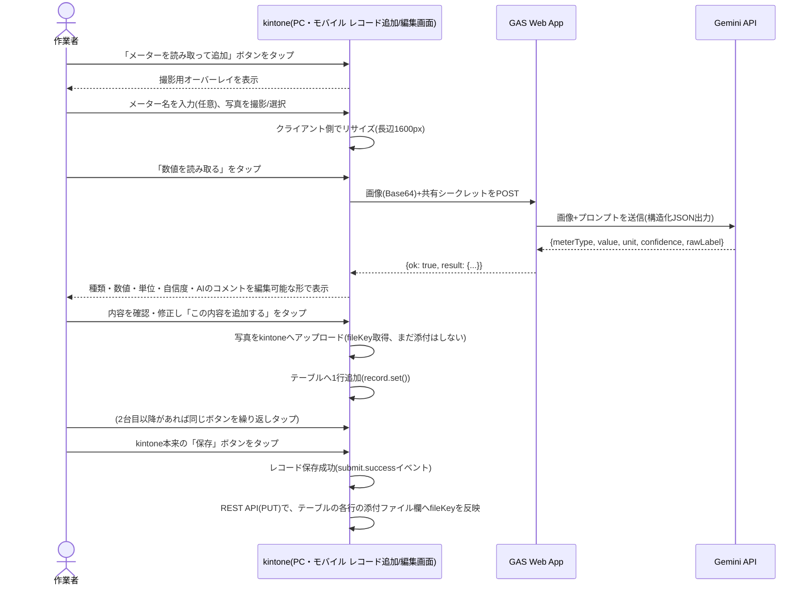

# meter-reader

アナログ針メーター(圧力計・温度計等)やデジタル表示メーターを撮影するだけで、写っている数値を自動認識してkintoneのテーブルへ記録するkintoneカスタマイズ + GAS(Google Gemini APIへの中継Web App)です。現場の作業者がスマートフォン・タブレットで撮影する運用を主に想定していますが、**PCから既存の画像ファイルをアップロードして読み取ることもできます**(PC・モバイルの両方に対応)。

## 背景

製造業の現場では、巡回点検のたびに複数台のメーター(アナログ針式・デジタル表示式が混在)を目視して手書き・端末入力する作業が発生します。本カスタマイズは、**メーターを撮影するだけ**でAIが数値を読み取り、確認・修正のうえでレコードのテーブルへ1行ずつ追加できます。1レコードに何台分でも読み取り結果を追加できるため、巡回ルート上の全メーターを1件のレコードにまとめて記録できます。

参考: 東芝の「ToruMeter」のような画像認識メーター読み取りサービスと同種の課題に対し、汎用の生成AI(マルチモーダルモデル)とkintone標準機能の組み合わせでシンプルに解決することを狙っています。

## 構成

- `src/` — kintone側(JS/CSSカスタマイズとして対象アプリへ直接アップロードする。撮影UI・リサイズ・GAS呼び出し・kintoneへの反映)
- `gas/` — Google Apps Script側(Gemini APIへの中継Web App)。セットアップ手順は [gas/README.md](./gas/README.md) を参照

## 特長

- 写真を撮る(または選ぶ)→「数値を読み取る」→ 内容を確認 →「この内容を追加する」の4ステップだけで完結
- アナログ針メーター・デジタル表示メーターの両方に、1つの仕組みで対応(マルチモーダルAIによる画像理解のため)
- 認識結果は編集可能なプレビューを経てからテーブルへ追加するため、誤読みをその場で修正できる(「下書き自動作成」という位置付け)
- AIが申告する「自信度(高/中/低)」を記録・表示し、自信度が低い場合は目視確認を促す警告を出す
- 撮影した写真の原本も、テーブルの行ごとに添付ファイルとして自動保存されるため、後から見返せる(現物との突き合わせ・監査対応)
- 1レコードに複数台分の読み取り結果をテーブルへ追加可能(`METER_TARGETS`配列で複数のテーブルにも対応可能)

## なぜこの方式か(技術選定の経緯)

以下は実装前に検討した内容で、方針を再検討する際は必ず踏まえてください(詳細は[CLAUDE.md](./CLAUDE.md)参照)。

1. **通常のOCR(文字認識)エンジンは不採用**: OCRは画像内の文字列を認識する技術であり、アナログ針メーターの「針の角度・目盛りの位置関係から数値を推定する」という読み取りには対応できない
2. **マルチモーダル対応の生成AI(Google Gemini API)を採用**: 画像とプロンプトを渡すだけで、計器の種類判定・数値推定・単位の読み取り・自信度の自己申告までをまとめて行える
3. Google AI StudioのAPIキーは、Cloud課金アカウントの紐付けなしで取得でき、無料枠を超えてもエラーになるだけで自動課金されない(`handwriting-input`のAzure AI Vision採用時と同じ判断基準)

**重要**: このセッションではネットワークポリシーによりGemini API公式ドキュメントへの直接アクセスができなかったため、モデル名・料金体系・レート制限の最新情報は未検証です。導入前に必ず[Gemini API公式ドキュメント](https://ai.google.dev/gemini-api/docs)を確認してください。

## 処理の流れ



**注意**: 添付ファイルフィールドは`kintone.app.record.set()`(モバイルでは`kintone.mobile.app.record.set()`)では更新できない仕様(公式ドキュメントの制限事項に明記)のため、「この内容を追加する」の時点ではテーブルの文字列・数値・ドロップダウン欄だけが入り、**写真はkintone本来の保存ボタンを押した後に反映されます**。詳細は[CLAUDE.md](./CLAUDE.md#なぜ追加するの時点で添付ファイルを直接セットしないのか重要)を参照してください。

## デモ用kintoneアプリの構成案:「設備点検」

顧客デモ・検証用に、以下のようなシンプルな設備点検アプリを想定しています。実運用では、対象顧客の既存の点検記録アプリにテーブルを追加する形でも組み込めます。

### フィールド一覧

| フィールドコード  | 型                                  | 説明                                                         |
| ----------------- | ----------------------------------- | ------------------------------------------------------------ |
| `RECORD_DATE`     | 日付                                | 点検日                                                       |
| `WORKER_NAME`     | 文字列(1行)                         | 点検者                                                       |
| `LOCATION_NAME`   | 文字列(1行)                         | 設置場所・ライン名                                           |
| `space_meter_add` | スペース(要素ID: `space_meter_add`) | 「メーターを読み取って追加」ボタンの設置場所(テーブルの直前) |
| `METER_READINGS`  | テーブル                            | メーター読み取り結果(1行=1台分)                              |

### `METER_READINGS`テーブルのサブフィールド一覧

| フィールドコード   | 型                                         | 説明                                           |
| ------------------ | ------------------------------------------ | ---------------------------------------------- |
| `METER_NAME`       | 文字列(1行)                                | メーター名(例:「1号ボイラー圧力計」。任意入力) |
| `METER_TYPE`       | ドロップダウン(選択肢: アナログ／デジタル) | AIが判定した種類(修正可能)                     |
| `METER_VALUE`      | 数値                                       | AIが読み取った数値(修正可能)                   |
| `METER_UNIT`       | 文字列(1行)                                | 単位(例: MPa, ℃, kWh。修正可能)                |
| `METER_CONFIDENCE` | ドロップダウン(選択肢: 高／中／低)         | AIが自己申告した自信度                         |
| `METER_NOTE`       | 文字列(複数行)                             | AIの判断根拠のコメント(参考情報)               |
| `METER_PHOTO`      | 添付ファイル                               | 撮影した写真の原本(自動保存)                   |

### レイアウト上の注意

スペースフィールド(`space_meter_add`)は、`METER_READINGS`テーブルの**直前**に配置してください(kintoneの仕様上、スペースフィールドはテーブルの内部には配置できません)。スペースフィールドの要素IDは、フィールド配置後に「スペースフィールド」設定画面で指定します(`src/desktop.js`の`METER_TARGETS`の`spaceId`と一致させること)。

## デモの見せ方(提案)

1. 印刷したアナログ圧力計の画像(またはミニチュアの実物メーター)をスマートフォンで撮影し、「数値を読み取る」をタップする
2. 数秒後に種類(アナログ)・数値・単位が自動入力され、自信度が表示される様子を見せる
3. デジタル表示の電力メーター等でも同様に試し、同じ操作フローで両方式に対応できることを紹介する
4. 「この内容を追加する」→ 別のメーターも続けて追加 →kintoneの保存ボタンを押し、テーブルに複数行(写真付き)が記録される様子を見せる

## セットアップ

### 1. GAS側(Gemini中継Web App)

[gas/README.md](./gas/README.md) の手順に従い、Google AI StudioでのAPIキー発行・GAS Web Appのデプロイを行ってください。**この手順は開発側(納品元)が一度だけ行うもので、顧客側の作業ではありません。**

### 2. kintone側

対象アプリに、上記「デモ用kintoneアプリの構成案」を参考にフィールド・テーブルを作成してください(実際のフィールドコード・要素IDは`src/desktop.js`の`METER_TARGETS`と一致させること)。

`src/desktop.js`の以下2箇所を、実際の値に書き換えてください。

```js
const GAS_WEB_APP_URL =
    'https://script.google.com/macros/s/REPLACE_WITH_DEPLOYMENT_ID/exec';
const GAS_SHARED_SECRET = 'REPLACE_WITH_SHARED_SECRET';
```

「アプリの設定」→「JavaScript / CSSでカスタマイズ」から、以下を**「PC用」「モバイル用」の両方**にアップロードしてください(同じファイルを両方にアップロードして共用する方式です。片方だけにアップロードすると、そちらの画面でしかボタンが表示されません)。

- JavaScript: `src/desktop.js`
- CSS: `src/css/desktop.css`

ボタンは「📷 メーターを読み取って追加」の1つです。押すと、カメラが起動できる環境ではカメラが直接開き、そうでない環境ではOS標準のメニュー(写真を撮る・写真を選ぶ等)が表示されます。

## 動作確認済みの範囲・未検証の範囲(正直な現状)

- テーブルへの行追加・添付ファイルの2段階反映(`buildMeterAttachmentPatch`)・認識結果のパース・数値/ラベルの正規化処理は、jsdomを使ったVitestで単体テスト済み(`npm run test`)
- ボタン設置・オーバーレイ表示・キャンセル時のスクロール固定解除等のPC・モバイル両方のAPI呼び出しも、jsdomを使ったVitestで検証済み
- **スマートフォンの実機(iOS Safari・Android Chrome)でのカメラ起動・アップロード、PCブラウザでのファイル選択・アップロードは未確認**
- **Gemini APIによる実際のメーター読み取り精度(特にアナログ針メーターの角度からの数値推定精度)は未検証**。導入前に、実際の顧客の現場にあるメーターの写真サンプルで認識精度を確認してください
- GAS Web Appのデプロイ・Gemini APIの疎通確認手順は[gas/README.md](./gas/README.md)のcurlでの動作確認手順を参照してください

## 既知の制約

[CLAUDE.md](./CLAUDE.md) の「既知の制約」を参照してください。

## ライセンス

[MIT License](../../LICENSE)
