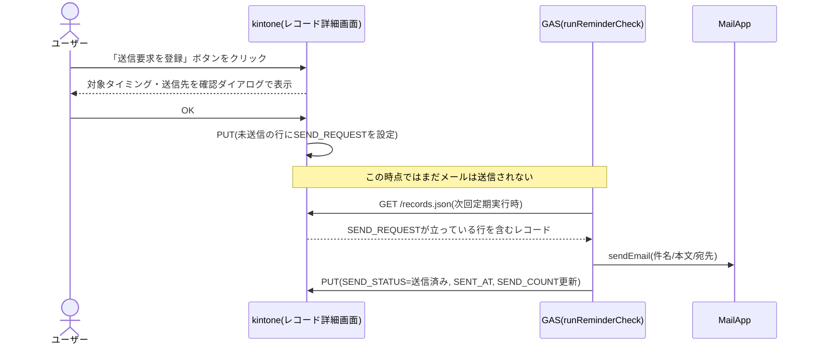
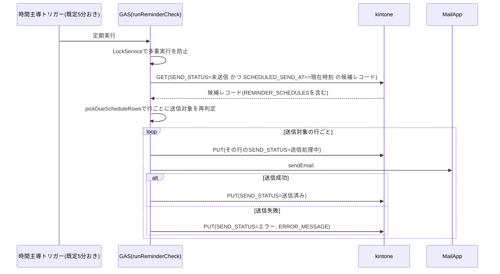
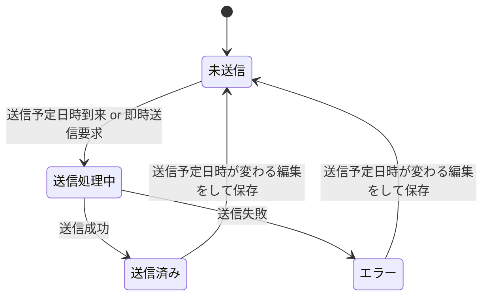

# reminder-notify

期日から算出した送信予定日時になると、Google Apps Script経由でリマインドメールを自動送信するkintoneカスタマイズ + GASです。

## 構成

- `src/` — kintone側（JS/CSSカスタマイズとして対象アプリへ直接アップロードする。送信予定日時の算出・保存時バリデーション・即時送信ボタン）
- `gas/` — Google Apps Script側（対象レコードの定期チェック・メール送信・結果書き戻し）。セットアップ手順は [gas/README.md](./gas/README.md) を参照

## 特長

- 1件の納期に対して**複数の送信タイミング**（例: 7日前・3日前・前日）を設定可能。「納期」と、各タイミングの「何日前に送るか」「送信時刻」から送信予定日時を自動算出
- レコード詳細画面から手動で即時送信をリクエストできる（未送信のタイミングをまとめて対象にする）
- 実際の送信はGAS側が担当するため、kintone側はメール送信のためのAPIリクエストを消費しない
- 送信先テーブルの「送信区分」でTO/CC/BCCを振り分け
- GAS側は多重実行防止（LockService）・送信可能数チェック・メールアドレス形式チェックにより、運用中のエラーを早期に検知
- 個々のレコードに原因があるエラーはkintone上の`ERROR_MESSAGE`で確認できるが、認証失敗等の個々の行に紐付かないシステム全体のエラーはkintone側から検知できないため、GAS側で管理者へメール通知する（`ADMIN_NOTIFY_EMAIL`。[CLAUDE.md](./CLAUDE.md#エラーの気付き方個々の行のエラー-vs-管理者通知メール)参照）

## 処理の流れ

### 手動での即時送信

「今すぐメール送信」ボタンはその場でメールを送るわけではなく、対象タイミングに印を付けるだけです。実際の送信は次のGAS定期実行を待って行われます。

### GASによる自動送信（時間主導トリガー）

### 送信ステータスの状態遷移（`REMINDER_SCHEDULES`の行ごと）

送信済み・エラーの行を編集して保存しても、その行の送信予定日時が実際には変わっていない場合は状態を維持します（無関係な項目を直しただけで送信履歴が消えたり、意図せず再送信されたりしないようにするため）。送信タイミングを変えずに再送信したい場合（例: メールアドレスの誤りだけを直した場合）は、`SEND_STATUS`を手動で「未送信」に変更して保存してください。停止は、GAS側の対象抽出条件から除外するための状態で、UIからの自動遷移はありません（手動設定のみ）。

フィールドコードは`src/desktop.js`（kintone側）・`gas/src/Config.js`（GAS側）の両方に固定値として定義している。設定画面は持たないため、**対象アプリを[CLAUDE.md](./CLAUDE.md)記載のフィールドコードで作成すること**が前提となる。複数アプリで使い回したい場合はフィールドコードをアプリ側で合わせるか、`desktop.js`内の`FIELD`定数を書き換えて使う。

kintone側は`manifest.json`によるパッケージングを持たないプレーンなJS/CSSカスタマイズのため、「JavaScript / CSSでカスタマイズ」画面でのアップロードは手作業になる。ファイル数が増えるほどアップロードの手間・順序ミスのリスクが増えるため、`src/desktop.js`1ファイルに責務ごとのセクションコメントで区切って実装している（プラグインの`src/js/`のようなファイル分割はしない）。

## セットアップ

### 1. kintone側

「アプリの設定」→「JavaScript / CSSでカスタマイズ」から、以下をPC用ファイルとしてアップロードしてください。

- JavaScript: `src/desktop.js`
- CSS: `src/css/51-modern-default.css` → `src/css/desktop.css`

対象アプリには、[CLAUDE.md](./CLAUDE.md) に記載のフィールドコードで、以下のフィールドを用意してください。

- 文字列: タイトル(`TITLE`)、メール件名(`MAIL_SUBJECT`)、メール本文(`MAIL_BODY`)
- 日付: 納期(`DEADLINE`)
- テーブル: 送信先(`RECIPIENTS`。サブフィールド`RECIPIENT_CODE`/`RECIPIENT_NAME`/`RECIPIENT_EMAIL`/`RECIPIENT_TYPE`)
- テーブル: 送信タイミング(`REMINDER_SCHEDULES`。1行＝1回のリマインド。サブフィールド`DAYS_BEFORE`/`SEND_TIME`/`SCHEDULED_SEND_AT`/`SEND_STATUS`/`SEND_REQUEST`/`SENT_AT`/`ERROR_MESSAGE`/`SEND_COUNT`)

各サブフィールドの型は[CLAUDE.md](./CLAUDE.md)のフィールド一覧を参照してください。

### 2. GAS側

[gas/README.md](./gas/README.md) の手順に従い、Apps Scriptプロジェクトを作成し、時間主導型トリガーを設定してください。

## ライセンス

[MIT License](../../LICENSE)
