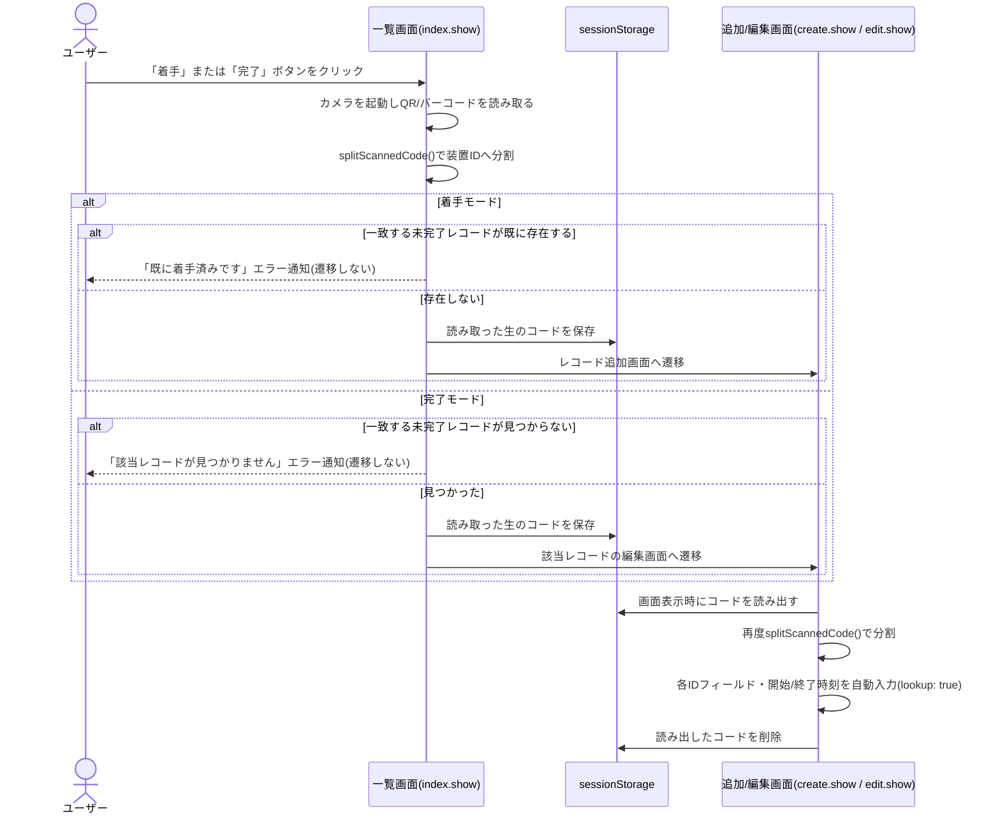

# start-completion-sample

[`code-reader`](../../) プラグインを前提とした、着手/完了打刻カスタマイズの実装例です。プラグイン単体のポートフォリオ掲載に加え、実際のアプリでどう組み合わせて使うかを示すサンプルとして掲載しています。

装置ID関連フィールド（`SEIBAN`等）・着手/完了打刻用フィールド（`TYAKUSYU_DT`/`KANRYO_DT`）は、あくまでサンプル値です。実際のアプリのフィールドコード・桁数に合わせて `src/desktop.js` 冒頭の `CONFIG` を変更してください。

## 前提

- `plugins/code-reader` プラグインを対象アプリに追加していること
- プラグイン設定画面の「書き込み先フィールドコード」は**空欄のまま**にすること（このサンプルはプラグインの自動書き込み機能ではなく、`CodeReaderPlugin` 名前空間配下の `QRReader`/`BarcodeReader` クラスを直接呼び出して、複数フィールドへの入力・画面遷移を伴う独自ワークフローを実装しているため）
- `code-reader`の名前空間参照は各イベントハンドラー内で都度読み直しています（kintoneはカスタマイズをプラグインより先に読み込むため）

## 機能

- レコード一覧画面のヘッダーに「着手」「完了」ボタンを表示
- ボタン押下でカメラを起動し、QRコード/バーコードで装置IDを読み取る
- 着手: 読み取ったIDが未着手であればレコード追加画面へ遷移し、装置ID・開始時刻を自動入力
- 完了: 読み取ったIDに一致する未完了レコードの編集画面へ遷移し、終了時刻を自動入力
- 読み取った1つのコードを、桁数（既定）または区切り文字で分割し、`CONFIG.ID_FIELDS`の順番でそれぞれ別フィールドに設定（分割ロジックはcode-readerプラグイン本体のものを再利用）
- 書き込み先がルックアップフィールドの場合、参照先アプリからの値の自動取得まで行う

## 処理の流れ

読み取り自体は一覧画面で行うが、実際のフィールド入力は画面遷移後（レコード追加・編集画面の表示時）に行われる。読み取った生のコードは`sessionStorage`経由で画面をまたいで受け渡す。

## 適用方法

このディレクトリはプラグインではなく通常のJavaScriptカスタマイズです。「アプリの設定」→「JavaScript / CSSでカスタマイズ」から、`src/desktop.js` をPC用・モバイル用JavaScriptファイルとして直接アップロードしてください。

## 個別仕様

[CLAUDE.md](./CLAUDE.md) を参照してください。

## ライセンス

[MIT License](../../../../LICENSE)
